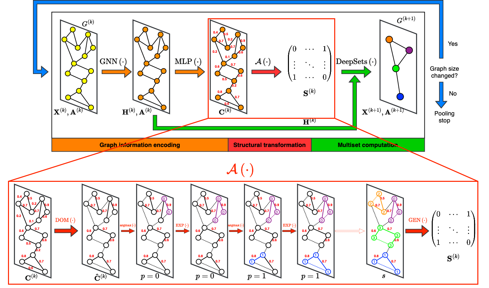

# Graph Parsing Networks

The official implementation of the paper "Graph Parsing Networks" ([ICLR 2024](https://openreview.net/forum?id=hv3SklibkL)).

<p align="middle">

</p>

## Dependencies

See `requirements.txt`.

## Run

We manage our experiments with [wandb](https://wandb.ai), to reproduce the results we reported in our paper, follow these steps:

- First of all, in order to store the wandb files afterwards, please create the `configs` and `remote` folders in the GPN project root directory.
- We provide hyperparameters for each dataset in the `best_params` folder. You can use them to create sweep and remember to indicate your wandb username and project name.

    ```
    python sweep.py --entity=$YOUR_WANDB_ENTITY$ --project=$YOUR_WANDB_PROJECT$ --source=file --info=best_params/$DATASET_NAME$.yaml
    ```

    Please note that `$YOUR_WANDB_ENTITY$` and `$YOUR_WANDB_PROJECT$` are your wandb username and project's name.

- You will get an sweep ID `$SWEEP_ID$` and sweep URL `$SWEEP_URL$` from last step, like:

    ```
    Create sweep with ID: $SWEEP_ID$
    Sweep URL: $SWEEP_URL$
    ```

    Next you can choose to run the program using a single process or in parallel.

- If you are using a single process

    ```
    python agents.py --entity=$YOUR_WANDB_ENTITY$ --project=$YOUR_WANDB_PROJECT$ --sweep_id=$SWEEP_ID$ --gpu_allocate=$INDEX_GPU$:1 --wandb_base=remote --mode=one-by-one --save_model=False
    ```

- If you are using multiple processes

    ```
    python agents.py --entity=$YOUR_WANDB_ENTITY$ --project=$YOUR_WANDB_PROJECT$ --sweep_id=$SWEEP_ID$ --gpu_allocate=$INDEX_GPU$:$PARALLEL_RUNS$ --wandb_base=temp --mode=parallel --save_model=False
    ```

    Parameter `$INDEX_GPU$:$PARALLEL_RUNS$` indicates that we will run `$PARALLEL_RUNS$` runs in parallel with GPU `$INDEX_GPU$`. In multi-process mode, you can use `-` to connect any number of graphics cards to deploy tasks on multiple graphics cards at the same time. Example: `--gpu_allocate=0:3-1:3`

- You can check the results in `$SWEEP_URL$`, a website hosted on [wandb.ai](https://wandb.ai).

## Citation

If you found the provided code with our paper useful in your work, we kindly request that you cite our work. 

```BibTex
@inproceedings{song2024graph,
    title={Graph Parsing Networks},
    author={Yunchong Song and Siyuan Huang and Xinbing Wang and Chenghu Zhou and Zhouhan Lin},
    booktitle={The Twelfth International Conference on Learning Representations},
    year={2024}
}
```
